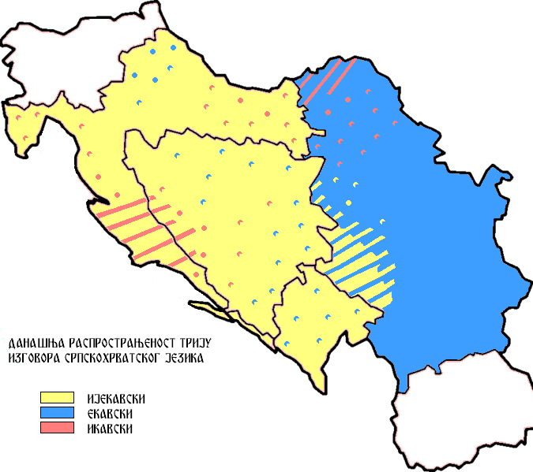
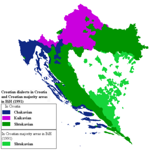
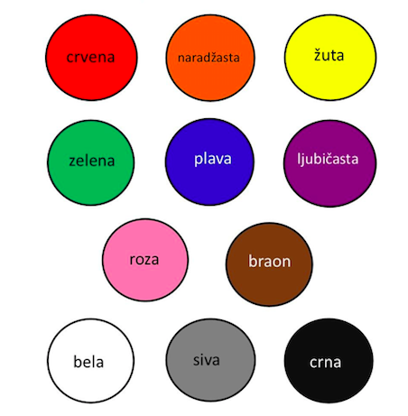

```{r setup, include=FALSE}
knitr::opts_chunk$set(warning=FALSE, message=FALSE, echo = TRUE)
```

```{r data import, include=FALSE}
library(tidyverse)
library(stringi)

theme_set(theme_bw())

source("../../../shared/analysis.R")

df = read.csv("../data/2_color_norming_main-merged_cleaned.csv", header = TRUE)

df$response = tolower(df$response)


# ####### GET RID OF ALL THINGS THAT ARE NOT LETTERS!!!
df$response = str_replace_all(df$response, "/", "")
df$response = str_replace_all(df$response, "\\\\", "")
df$response = str_replace_all(df$response, ";", "")
df$response = str_replace_all(df$response, "\'", "")
df$response = str_replace_all(df$response, "<", "")
df$response = str_replace_all(df$response, "\n", "")
df$response = str_replace_all(df$response, " ", "")
df$response = str_replace_all(df$response, "\\?", "")

# Replace all single word color responses with a standardized color label

df$response = str_replace_all(df$response, "bela\\b", "belo")
df$response = str_replace_all(df$response, "bele\\b", "belo")
df$response = str_replace_all(df$response, "beli\\b", "belo")
df$response = str_replace_all(df$response, "bije;a\\b", "belo")
df$response = str_replace_all(df$response, "bijea\\b", "belo")
df$response = str_replace_all(df$response, "bijel\\b", "belo")
df$response = str_replace_all(df$response, "bijela\\b", "belo")
df$response = str_replace_all(df$response, "bijele\\b", "belo")
df$response = str_replace_all(df$response, "bijeli\\b", "belo")
df$response = str_replace_all(df$response, "bijelo\\b", "belo")
df$response = str_replace_all(df$response, "bijrla\\b", "belo")
df$response = str_replace_all(df$response, "biojele\\b", "belo")
df$response = str_replace_all(df$response, "bjeal\\b", "belo")
df$response = str_replace_all(df$response, "bjel\\b", "belo")
df$response = str_replace_all(df$response, "bjela\\b", "belo")
df$response = str_replace_all(df$response, "bjel\\b", "belo")
df$response = str_replace_all(df$response, "bjelo\\b", "belo")
df$response = str_replace_all(df$response, "bjeli\\b", "belo")
df$response = str_replace_all(df$response, "bijelo\\b", "belo")

df$response = str_replace_all(df$response, "cne\\b", "crno")
df$response = str_replace_all(df$response, "cren\\b", "crno")
df$response = str_replace_all(df$response, "crn\\b", "crno")
df$response = str_replace_all(df$response, "crna\\b", "crno")
df$response = str_replace_all(df$response, "crne\\b", "crno")
df$response = str_replace_all(df$response, "crni\\b", "crno")
df$response = str_replace_all(df$response, "crnq\\b", "crno")

df$response = str_replace_all(df$response, "crven\\b", "crveno")
df$response = str_replace_all(df$response, "crneven\\b", "crveno")
df$response = str_replace_all(df$response, "crvena\\b", "crveno")
df$response = str_replace_all(df$response, "crvene\\b", "crveno")
df$response = str_replace_all(df$response, "crveni\\b", "crveno")
df$response = str_replace_all(df$response, "cvene\\b", "crveno")
df$response = str_replace_all(df$response, "crvani\\b", "crveno")
df$response = str_replace_all(df$response, "crvreni\\b", "crveno")
df$response = str_replace_all(df$response, "crvr\\b", "crveno")

df$response = str_replace_all(df$response, "jubicasti\\b", "ljubicasto")
df$response = str_replace_all(df$response, "ljubicaaste\\b", "ljubicasto")
df$response = str_replace_all(df$response, "ljubicasa\\b", "ljubicasto")
df$response = str_replace_all(df$response, "ljubicaset\\b", "ljubicasto")
df$response = str_replace_all(df$response, "ljubicasrte\\b", "ljubicasto")
df$response = str_replace_all(df$response, "ljubicast\\b", "ljubicasto")
df$response = str_replace_all(df$response, "ljubičast\\b", "ljubicasto")
df$response = str_replace_all(df$response, "ljubicasta\\b", "ljubicasto")
df$response = str_replace_all(df$response, "ljubičastaa\\b", "ljubicasto")
df$response = str_replace_all(df$response, "ljubicaste\\b", "ljubicasto")
df$response = str_replace_all(df$response, "ljubičaste\\b", "ljubicasto")
df$response = str_replace_all(df$response, "ljubicasti\\b", "ljubicasto")
df$response = str_replace_all(df$response, "ljubičasti\\b", "ljubicasto")
df$response = str_replace_all(df$response, "ljubičasto\\b", "ljubicasto")
df$response = str_replace_all(df$response, "ljubičastta\\b", "ljubicasto")
df$response = str_replace_all(df$response, "ljubiccaste\\b", "ljubicasto")
df$response = str_replace_all(df$response, "ljubicsra\\b", "ljubicasto")
df$response = str_replace_all(df$response, "ljubicsti\\b", "ljubicasto")
df$response = str_replace_all(df$response, "ljubivasto\\b", "ljubicasto")
df$response = str_replace_all(df$response, "Ljuicaste\\b", "ljubicasto")
df$response = str_replace_all(df$response, "ljuvičaste\\b", "ljubicasto")
df$response = str_replace_all(df$response, "ljubicasna\\b", "ljubicasto")
df$response = str_replace_all(df$response, "ljubicasno\\b", "ljubicasto")
df$response = str_replace_all(df$response, "ljubičasta\\b", "ljubicasto")
df$response = str_replace_all(df$response, "ljuvičaste\\b", "ljubicasto")
df$response = str_replace_all(df$response, "ljubicastno\\b", "ljubicasto")
df$response = str_replace_all(df$response, "ljubicast\\b", "ljubicasto")
df$response = str_replace_all(df$response, "ljubicasye\\b", "ljubicasto")
df$response = str_replace_all(df$response, "ljubocasta\\b", "ljubicasto")
df$response = str_replace_all(df$response, "ljuicaste\\b", "ljubicasto")
df$response = str_replace_all(df$response, "lljubicasto\\b", "ljubicasto")

df$response = str_replace_all(df$response, "naradjanska\\b", "narandzasto")
df$response = str_replace_all(df$response, "naradzan\\b", "narandzasto")
df$response = str_replace_all(df$response, "naradzanska\\b", "narandzasto")
df$response = str_replace_all(df$response, "naradzasta\\b", "narandzasto")
df$response = str_replace_all(df$response, "naranasta\\b", "narandzasto")
df$response = str_replace_all(df$response, "narancast\\b", "narandzasto")
df$response = str_replace_all(df$response, "narančast\\b", "narandzasto")
df$response = str_replace_all(df$response, "narancasta\\b", "narandzasto")
df$response = str_replace_all(df$response, "narančasta\\b", "narandzasto")
df$response = str_replace_all(df$response, "narancasta\\b", "narandzasto")
df$response = str_replace_all(df$response, "narancaste\\b", "narandzasto")
df$response = str_replace_all(df$response, "narančaste\\b", "narandzasto")
df$response = str_replace_all(df$response, "Narancaste\\b", "narandzasto")
df$response = str_replace_all(df$response, "narančaste boje\\b", "narandzasto")
df$response = str_replace_all(df$response, "narancasti\\b", "narandzasto")
df$response = str_replace_all(df$response, "narančasti\\b", "narandzasto")
df$response = str_replace_all(df$response, "narancasto\\b", "narandzasto")
df$response = str_replace_all(df$response, "narančasto\\b", "narandzasto")
df$response = str_replace_all(df$response, "narančste\\b", "narandzasto")
df$response = str_replace_all(df$response, "naranđasta\\b", "narandzasto")
df$response = str_replace_all(df$response, "narandjanska\\b", "narandzasto")
df$response = str_replace_all(df$response, "narandjast\\b", "narandzasto")
df$response = str_replace_all(df$response, "narandzast\\b", "narandzasto")
df$response = str_replace_all(df$response, "narandzasta\\b", "narandzasto")
df$response = str_replace_all(df$response, "narandžasta\\b", "narandzasto")
df$response = str_replace_all(df$response, "narandzaste\\b", "narandzasto")
df$response = str_replace_all(df$response, "narandzaste\\b", "narandzasto")
df$response = str_replace_all(df$response, "narandzasti\\b", "narandzasto")
df$response = str_replace_all(df$response, "narandzasto\\b", "narandzasto")
df$response = str_replace_all(df$response, "naranzdaste\\b", "narandzasto")
df$response = str_replace_all(df$response, "narnčasto\\b", "narandzasto")
df$response = str_replace_all(df$response, "nrandzasta\\b", "narandzasto")
df$response = str_replace_all(df$response, "nrandzaste\\b", "narandzasto")
df$response = str_replace_all(df$response, "narančasteboje\\b", "narandzasto")
df$response = str_replace_all(df$response, "narandast\\b", "narandzasto")
df$response = str_replace_all(df$response, "narandasta\\b", "narandzasto")
df$response = str_replace_all(df$response, "narandasti\\b", "narandzasto")
df$response = str_replace_all(df$response, "narandasto\\b", "narandzasto")
df$response = str_replace_all(df$response, "narandjasto\\b", "narandzasto")
df$response = str_replace_all(df$response, "narandžaste\\b", "narandzasto")
df$response = str_replace_all(df$response, "narandzastno\\b", "narandzasto")
df$response = str_replace_all(df$response, "narandzasto\\b", "narandzasto")
df$response = str_replace_all(df$response, "narndjasto\\b", "narandzasto")
df$response = str_replace_all(df$response, "narndzaste\\b", "narandzasto")
df$response = str_replace_all(df$response, "narancast\\b", "narandzasto")
df$response = str_replace_all(df$response, "narancaste\\b", "narandzasto")
df$response = str_replace_all(df$response, "narančasto\\b", "narandzasto")

df$response = str_replace_all(df$response, "plaava\\b", "plavo")
df$response = str_replace_all(df$response, "place\\b", "plavo")
df$response = str_replace_all(df$response, "placve\\b", "plavo")
df$response = str_replace_all(df$response, "plav\\b", "plavo")
df$response = str_replace_all(df$response, "plava\\b", "plavo")
df$response = str_replace_all(df$response, "plave\\b", "plavo")
df$response = str_replace_all(df$response, "plavel\\b", "plavo")
df$response = str_replace_all(df$response, "plavi\\b", "plavo")

df$response = str_replace_all(df$response, "siv\\b", "sivo")
df$response = str_replace_all(df$response, "siva\\b", "sivo")
df$response = str_replace_all(df$response, "sive\\b", "sivo")
df$response = str_replace_all(df$response, "sivi\\b", "sivo")

df$response = str_replace_all(df$response, "smeda\\b", "smedje")
df$response = str_replace_all(df$response, "smeđa\\b", "smedje")
df$response = str_replace_all(df$response, "smede\\b", "smedje")
df$response = str_replace_all(df$response, "smeđe\\b", "smedje")
df$response = str_replace_all(df$response, "smeđe4\\b", "smedje")
df$response = str_replace_all(df$response, "smedi\\b", "smedje")
df$response = str_replace_all(df$response, "smeđi\\b", "smedje")
df$response = str_replace_all(df$response, "smedja\\b", "smedje")
df$response = str_replace_all(df$response, "smedjje\\b", "smedje")
df$response = str_replace_all(df$response, "zmedje\\b", "smedje")


df$response = str_replace_all(df$response, "srebrena\\b", "srebrno")
df$response = str_replace_all(df$response, "srebrn\\b", "srebrno")
df$response = str_replace_all(df$response, "srebrna\\b", "srebrno")
df$response = str_replace_all(df$response, "srebrne\\b", "srebrno")
df$response = str_replace_all(df$response, "srebrni\\b", "srebrno")


df$response = str_replace_all(df$response, "yelen\\b", "zeleno")
df$response = str_replace_all(df$response, "yelena\\b", "zeleno")
df$response = str_replace_all(df$response, "yeleno\\b", "zeleno")
df$response = str_replace_all(df$response, "zalen\\b", "zeleno")
df$response = str_replace_all(df$response, "zaleni\\b", "zeleno")
df$response = str_replace_all(df$response, "zaleno\\b", "zeleno")
df$response = str_replace_all(df$response, "zalemna", "zeleno")
df$response = str_replace_all(df$response, "zelen\\b", "zeleno")
df$response = str_replace_all(df$response, "zelena\\b", "zeleno")
df$response = str_replace_all(df$response, "zelene\\b", "zeleno")
df$response = str_replace_all(df$response, "zeleni\\b", "zeleno")

df$response = str_replace_all(df$response, "zlatna\\b", "zlatno")
df$response = str_replace_all(df$response, "zlatne\\b", "zlatno")
df$response = str_replace_all(df$response, "zlatni\\b", "zlatno")

df$response = str_replace_all(df$response, "zut\\b", "zuto")
df$response = str_replace_all(df$response, "žut\\b", "zuto")
df$response = str_replace_all(df$response, "zuta\\b", "zuto")
df$response = str_replace_all(df$response, "žuta\\b", "zuto")
df$response = str_replace_all(df$response, "žutaa\\b", "zuto")
df$response = str_replace_all(df$response, "žutal\\b", "zuto")
df$response = str_replace_all(df$response, "zute\\b", "zuto")
df$response = str_replace_all(df$response, "žute\\b", "zuto")
df$response = str_replace_all(df$response, "zuteboje\\b", "zuto")
df$response = str_replace_all(df$response, "žuteboje\\b", "zuto")
df$response = str_replace_all(df$response, "zuti\\b", "zuto")
df$response = str_replace_all(df$response, "žuti\\b", "zuto")
df$response = str_replace_all(df$response, "zuto\\b", "zuto")
df$response = str_replace_all(df$response, "žuto\\b", "zuto")
df$response = str_replace_all(df$response, "zutra\\b", "zuto")

df$response = str_replace_all(df$response, "\n", "")
df$response = str_replace_all(df$response, " ", "")

subjectCleanUp <- df %>%
  select(workerid, schoolLanguage, firstLanguage, status) %>%
  unique()

view(subjectCleanUp)


# These are the statuses that were coded incorrectly:
# 165 <- native
# 151 <- native
# 155 <- native
# 244 <- heritage
# these incorrect codings are due to spelling errors and 
# listing two or more languages split up by / rather than spaces and commas


# Manually input them into the dataframe
df$status[df$workerid == 165] <- "native"
df$status[df$workerid == 151] <- "native"
df$status[df$workerid == 155] <- "native"
df$status[df$workerid == 244] <- "heritage"

# Get rid of participant 193 (answered the object names rather than colors)
df <- df %>%
  filter(workerid != 193)

df_split <- runAnalysis(df)

makePlots <- function(objectName) {
  x <- plot_df_subset(df_split[[objectName]], objectName)
  x
}

```


```{r participant data, echo=FALSE}
# Plot participant data
participant_info <- df %>%
  select(workerid, status) %>%
  unique() %>%
  group_by(status) %>%
  summarize(count=n())

plot_demographics <- participant_info %>%
  ggplot(aes(x = status, y = count)) +
  geom_bar(stat="identity")

participant_dialectOne <- df %>%
  select(workerid, subject_information.dialectOne) %>%
  unique() %>%
  group_by(subject_information.dialectOne) %>%
  summarize(count=n())

plot_dialectOne <- participant_dialectOne %>%
  ggplot(aes(x = subject_information.dialectOne, y = count)) +
  geom_bar(stat="identity")

participant_dialectTwo <- df %>%
  select(workerid, subject_information.dialectTwo) %>%
  unique() %>%
  group_by(subject_information.dialectTwo) %>%
  summarize(count=n())

plot_dialectTwo <- participant_dialectTwo %>%
  ggplot(aes(x = subject_information.dialectTwo, y = count)) +
  geom_bar(stat="identity")

participant_dialectCountry <- df %>%
  select(workerid, country) %>%
  unique() %>%
  group_by(country) %>%
  summarize(count=n())

plot_dialectCountry<- participant_dialectCountry %>%
  ggplot(aes(x = country, y = count)) +
  geom_bar(stat="identity")
```

# Participant Demographics
## Language status
This has yet to be cleaned up: people classified as "heritage" and "foreign" may actually be native of SIMK speakers.  
  
Foreign: first language and language spoken at school are not BCS  
Heritage: first language is BCS and language spoken at school is not BCS  
SIMK: Country of origin is Slovenia (SI) or Macedonia (MK)  
native: first language and language spoken at school are BCS  
  
  
```{r demographics, echo=FALSE}
plot_demographics
```


## Dialect Information
### Dialect Measure 1
Dialects are often split up based on the phonological change of the Common Slavic *jat* vowel (*ě), which changed to /i/ (Ikavian/Ikavica), /e/ (Ekavian/Ekavica), or /ije/ /je/ (Ijekavian/Ijekavica). Standard Croatian and Bosnian is based on Ijekavian, whereas standard Serbian is based on Ekavian. Serbians in Croatia, Bosnian Serbs, and Montenegrians mainly use Ijekavian. A geographic distribution is shown below. 




yellow: ijekaciva  
blue: ekavica  
red: ikavica   
  
  
Our participants had the following distribution:  

```{r dialectOne, echo=FALSE}
plot_dialectOne
```


### Dialect Measure 2
Another common way of classifying the dialects is based on their most common wuestion word for "what": 
  
Shtokavian (Štokavski) = što/šta  
Chakavian (Čakavski) = Ča/ca  
Kajkavian (Kajkavski) = Kaj/key
  
Shtokavian is the standard for all of BCS and is spoken in Bosnia and Herzegovina, Croatia, Montenegro, and Serbia. 
Chakavian is spoken on the Croatian coast and Kajkavian is spoken in northern Croatia. Slovenians use the word "kaj" for the "what" question word, therefore I assume Slovenians would be classified as Kaikavian speakers based on my dialect survey (even if they don't produce the word "kaj" when speaking BCS). 
  
The map below gives a geographic distribution of the three dialects in Croatia. Bosnia and Herzegovina, Mongenegro, and Serbia would all be colored green based on this map. 
  



Chakavian (blue) = Čakavski  
Kaikavian (purple) = Kajkavski  
Shtokavian (green) = Štokavski  

  
Our participants had the following dialect distribution:  
  
```{r dialectTwo, echo=FALSE}
plot_dialectTwo
```


### Country of participants
Participants answered the question: In which Ex-Jugoslav country did I live in/spent a lot of time in. This question aims to get a geographic distribution of participants. While we can classify speakers across ekavian/ikavian/ijekavian dialects, since this distiction represents a phonological one, it is unclear whether it will likewise reflect a difference in use of lexical items. Keep in mind that the answer to this question is distinct from what nationality participants identify as (for example there are Serbians, Croatians, and Bosnians who all live in Bosnia and Hercegovina). Based on my (limited) observations, I believe that country may be a better predictor of lexical items than national identity could be.  
    
BIH: Bosnia and Herzegovina  
HR: Croatia  
SRB: Serbia  
SI: Slovenia  
MK: Macedonia  
MNE: Montenegro  

```{r dialectCountry, echo=FALSE}
plot_dialectCountry
```


# Colors
A quick reference guide to colors in BCS. The longer responses are often compounds of multiple colors.



# Participant Responses

Responses that participants gave to the question "What is the color of this object?" are given below. Each graph is faceted based on the color the object was presented in. 
  

```{r objects, echo=FALSE}

lapply(names(df_split), makePlots)
```

